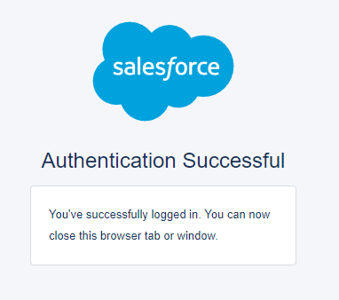
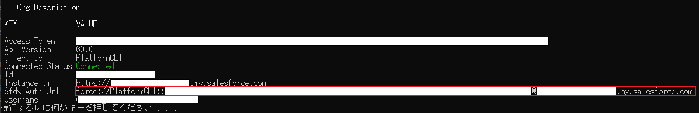
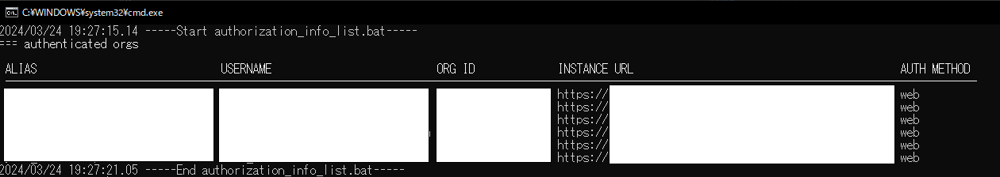
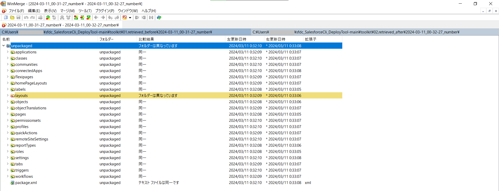

# Salseforce CLI (sf Commands) Deploy tool  
* Ant 移行ツールが Spring '24 で廃止になったためSalesforce CLIを使用したデプロイツールをBATファイルで作成しました。  
* CLIが苦手・コマンドを打つのが面倒　そんな方に是非！  

## 必要条件
下記を必ずインストールしておいてください。
* [Salesforce CLI ※sf (v2)](https://developer.salesforce.com/docs/atlas.ja-jp.sfdx_setup.meta/sfdx_setup/sfdx_setup_intro.htm)  
  * インストールやsfdx (v7) から sf (v2) への移行方法はSalesforceのHelpを確認ください。  

> [!TIP]
> 必須ではないため任意でインストールをお願いします。
> * [WinMerge](https://winmerge.org/?lang=ja)
>   * [メタデータの前後比較](#メタデータの前後比較)の際にWinMergeを使用します。  

## セットアップ
### 1. 接続情報の入力
- `..\toolkit\config\setting.ini`を開きます。  
  - 接続情報を入力します。  

| パラメータ | このステップでの入力対象箇所 | 値 |
| --- | --- | --- |
| SfMyDomain | ✅ | 組織の私のドメインを設定します。<br><br>※「私のドメイン」確認方法<br>Salesforce組織へログイン > 設定>クイック検索で「私のドメイン」入力・「私のドメイン」をクリック > [私のドメイン] の詳細セクション内の「現在の [私のドメイン] の URL」右横に記載のURL。<br>（コピー時には「https://」が付いていないので忘れずに！） |  
| SfUserName | ✅ | デプロイに使用するユーザーのSalesforce ユーザー名 |  
| SfdxAuthUrl | ☐ | Salesforce組織への認証情報を含む URLを記載のテキストファイルに設定します。 <br>※[後ほどの手順で取得方法を案内します。](#2-組織を認証-authorize-an-org-およびsfdx-auth-urlの取得) |  
| SoapApiVersion | ✅ | HTTPS の要求や応答の処理に使用されるメタデータ API のコアバージョンを指します。<br>※初期設定として`55.0`に設定しています。必要に応じて変更してください。 |  
| TestLevel | ✅ | 指定したテストレベルによってテストの範囲が変化します。<br>RunSpecifiedTests と RunAllTestsInOrgの指定が可能です。<br>・RunSpecifiedTests： 指定したテストのみを実行します。<br>・RunAllTestsInOrg：管理パッケージのテストを含む、組織内のすべてのテストが実行されます。 |  

> [!NOTE]
> 初期状態では、Org01のセクションを使用可能状態にしています。<br/>Org02、Org03も用意していますので必要に応じてコメントアウト「;」を切り替えて使用ください。  

### 2. 組織を認証 (Authorize an Org) およびSfdx Auth Urlの取得  
- `..\toolkit\Init_loginWeb_sfdxAuthUrl_cfm.bat`を実行します。  
  - コマンドプロンプトが開いた直ぐにブラウザ（Chrome）が起動するのでデプロイに使用するユーザー情報を入力して組織の認証を行います。<br>下記画像のような画面が表示されたら接続完了です。  
      

  - コマンドプロンプトに戻って`=== Org Description`が表示されているため`Sfdx Auth Url`（画像の赤枠）部分をコピーしてください。<br/>後ほど使用するのでどこかにメモしておいてください。  
      

  - コマンドプロンプトに表示される案内に沿って操作し処理を完了します。  

> [!CAUTION]
>***Sfdx Auth Urlは認証情報を含む URLのため取り扱いには注意を！！***  

### 3. Sfdx Auth Urlの設定  
※ここからは、[1. 接続情報の入力](#1-接続情報の入力)でOrg01を使用している前提で記載しています。  
- `..\toolkit\config\sfdxAuthUrl_org01.txt`を開きます。  
  - [2. 組織を認証 (Authorize an Org) およびSfdxAuthUrlの取得](#2-組織を認証-authorize-an-org-およびsfdx-auth-urlの取得)で取得した`Sfdx Auth Url`を張り付けて保存します。  

## 使用方法  
> [!IMPORTANT]
> 事故防止のためBat実行毎に組織への接続（ログイン）・切断（ログアウト）を行っています。  

### メタデータ取得
- 取得したいメタデータを`..\toolkit\retrievemanifest\package.xml`に記載します。  
  - 必要に応じて内容を編集してください。  
- `01.retrieve_before.bat`を実行します。  
  - 処理内容  
    - 組織への接続（ログイン）  
    - 組織のメタデータの取得  
    - 組織から切断（ログアウト）  
  - 処理結果  
    - Batファイルを実行した日時のフォルダ名（YYYY-MM-DD_HH-MM-SS_"number"形式）で`..\toolkit\01.retrieved_before`に格納します。  
- `02.retrieve_after.bat`を実行します。  
  - 処理内容  
    - 組織への接続（ログイン）  
    - 組織のメタデータの取得  
    - 組織から切断（ログアウト）  
  - 処理結果  
    - Batファイルを実行した日時のフォルダ名（YYYY-MM-DD_HH-MM-SS_"number"形式）で`..\toolkit\02.retrieved_after`に格納します。  

> [!NOTE]
> フォルダ名の"number"部分は固定のテキストですので、各プロジェクトのルールに沿って課題番号などに書き換えるなどして使用してください。  

### 現在の認証済の組織一覧表示  
- `authorization_info_list.bat`を実行します。  
  - コマンドプロンプトの`=== authenticated orgs`下に現在認証済の組織一覧が表示されます。  
      

### メタデータのデプロイ
- `..\toolkit\deploycodepkg`にデプロイ対象の資材を格納してください。  

> [!NOTE]
> 初期状態では、サンプル資材を格納しています。<br/>使用する際には`deploycodepkg`内の資材は削除してください。

  サンプル：Apexクラス2個 トリガ1個の場合
  ```
    ─deploycodepkg
      │  package.xml
      │
      ├─classes
      │      SampleDeployClass.cls
      │      SampleDeployClass.cls-meta.xml
      │      SampleFailingTestClass.cls
      │      SampleFailingTestClass.cls-meta.xml
      │
      └─triggers
              SampleAccountTrigger.trigger
              SampleAccountTrigger.trigger-meta.xml
  ```

- `..\toolkit\testclasslist.txt`にデプロイ時に実行するApexクラス名を半角スペース区切りで記載してください。  
  サンプル：Apexテストクラス3個実行する場合
  ```
  SampleFailingTestClass01 SampleFailingTestClass02 SampleFailingTestClass03
  ```
- `deploy_start.bat`を実行します。  
  - 処理内容  
    - 組織への接続（ログイン）  
    - デプロイ前のメタデータ取得  
    - デプロイ と Apexテストの実行  
    - デプロイ後のメタデータ取得  
    - 組織から切断（ログアウト）  
  - 処理結果  
    - デプロイ前のメタデータ取得処理が実行された日時のフォルダ名（YYYY-MM-DD_HH-MM-SS_"number"形式）で`..\toolkit\01.retrieved_before`に格納します。  
    - デプロイ後のメタデータ取得処理が実行された実行した日時のフォルダ名（YYYY-MM-DD_HH-MM-SS_"number"形式）で`..\toolkit\02.retrieved_after`に格納します。  
    - 処理の記録をBatファイルを実行した日時のフォルダ名（"deploy"_MMDDHHMMSS.log形式）でlogファイルを`..\toolkit\log\deploy`に格納します。  

### Sfdx Auth Urlの取得（セットアップ）  
- [こちらを確認してください。](#セットアップ)  

### 組織への接続（ログイン）  
- `login_org_sfdx_url.bat`を実行します。<br/>※Sfdx Auth Urlが設定(セットアップが完了)されている前提です。  
  - 処理内容  
    - 組織への接続（ログイン）  

### 組織から切断（ログアウト）  
- `logout_org.bat`を実行します。  
  - 処理内容  
    - 組織から切断（ログアウト）  

### メタデータの前後比較  
- `openWinMerge.bat`を実行します。  
  - 処理内容  
    - `..\toolkit\01.retrieved_before`内の最新のフォルダを取得。  
    - `..\toolkit\02.retrieved_after`内の最新のフォルダを取得。  
    - WinMergeを起動して上記で取得したフォルダ同士を比較します。  
      

## ディレクトリ構成  
```ディレクトリ構成図
─toolkit
    │  01.retrieve_before.bat
    │  02.retrieve_after.bat
    │  authorization_info_list.bat
    │  deploy_start.bat
    │  Init_loginWeb_sfdxAuthUrl_cfm.bat
    │  login_org_sfdx_url.bat
    │  logout_org.bat
    │  openWinMerge.bat
    │  testclasslist.txt
    │
    ├─01.retrieved_before
    │      forpush.txt  ←空ファイル（Githubフォルダ作成のため）
    │
    ├─02.retrieved_after
    │      forpush.txt  ←空ファイル（Githubフォルダ作成のため）
    │
    ├─config
    │      setting.ini
    │      sfdxAuthUrl_org01.txt
    │      sfdxAuthUrl_org02.txt
    │      sfdxAuthUrl_org03.txt
    │
    ├─deploycodepkg
    │  │  package.xml ←サンプルコード
    │  │
    │  ├─classes ←サンプルコード
    │  │      SampleDeployClass.cls
    │  │      SampleDeployClass.cls-meta.xml
    │  │      SampleFailingTestClass.cls
    │  │      SampleFailingTestClass.cls-meta.xml
    │  │
    │  └─triggers ←サンプルコード
    │          SampleAccountTrigger.trigger
    │          SampleAccountTrigger.trigger-meta.xml
    │
    ├─log
    │  └─deploy
    │          forpush.txt  ←空ファイル（Githubフォルダ作成のため）
    │
    └─retrievemanifest
            package.xml
```
